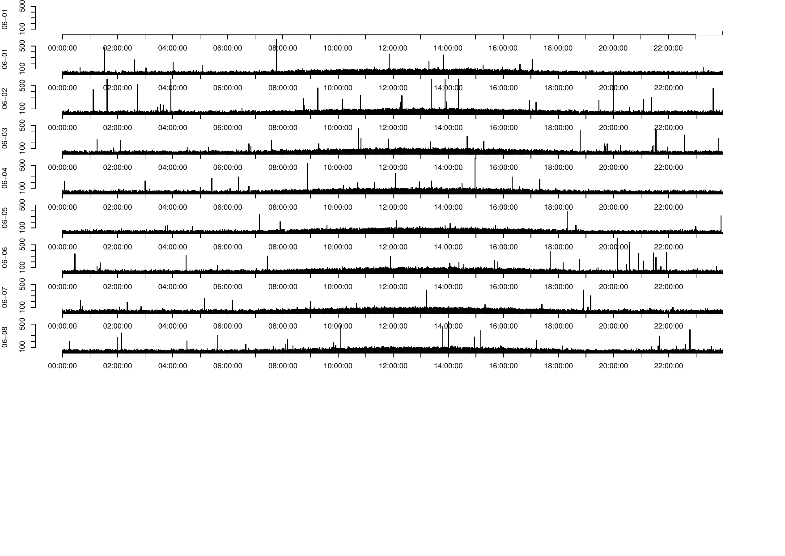

# ACTman

[](https://github.com/markspan/ACTman/actions/workflows/R-CMD-check.yaml)
[](https://github.com/markspan/ACTman/actions/workflows/test-coverage.yaml)
[](https://codecov.io/gh/markspan/ACTman)

**ACTman** is an R package for managing and analyzing wrist actigraphy data.
It ingests raw exports from supported actigraphy devices, computes standard
non-parametric circadian rhythm variables, scores nights of sleep against a
sleep log, generates actograms, and (optionally) tracks a set of
distributional "early warning signal" statistics over a moving window.

This document is a full manual: installation, concepts, data formats, a
function-by-function reference with examples, the package's internal
architecture, and the scientific literature the calculations are based on.

- [Installation](#installation)
- [Quick start](#quick-start)
- [Supported devices and data formats](#supported-devices-and-data-formats)
- [Concepts](#concepts)
  - [Circadian rhythm analysis (IS, IV, RA, L5, M10)](#circadian-rhythm-analysis)
  - [Sleep scoring and the sleep log](#sleep-scoring-and-the-sleep-log)
  - [Moving window analysis and early warning signals](#moving-window-analysis-and-early-warning-signals)
  - [Actograms](#actograms)
- [Package architecture](#package-architecture)
- [Function reference](#function-reference)
- [Working directory layout and output files](#working-directory-layout-and-output-files)
- [Testing](#testing)
- [Known limitations](#known-limitations)
- [Changelog](#changelog)
- [References](#references)
- [License](#license)

## Installation

```r
install.packages("devtools")
devtools::install_github("markspan/ACTman")
```

ACTman depends on:

| Package | Used for |
|---|---|
| `dplyr` | `lag()`/`lead()`/`mutate()` in epoch scoring |
| `moments` | Skewness and kurtosis (EWS metrics) |
| `mice` | Multiple imputation of missing activity values (`na_impute = TRUE`) |
| `nparACT` | Optional cross-validation against an independent implementation (`nparACT_compare = TRUE`) |
| `lubridate` | DST-safe calendar arithmetic (`increase_by_days()`) |
| `stats`, `utils`, `graphics`, `grDevices` | Base R functionality (aggregation, plotting, file I/O) |

## Quick start

```r
library(ACTman)

## 1. Just the file-level overview (start/end times, missings, recording length):
result <- ACTman(
  workdir = "~/actigraphy/study1",
  myACTdevice = "Actiwatch2",
  circadian_analysis = FALSE,
  iwantsleepanalysis = FALSE,
  plotactogram = FALSE
)
result$overview

## 2. Overview + non-parametric circadian rhythm variables (IS, IV, RA, L5, M10):
result <- ACTman(
  workdir = "~/actigraphy/study1",
  myACTdevice = "Actiwatch2",
  circadian_analysis = TRUE
)
result$circadian

## 3. Sleep analysis against a sleeplog.csv (see data format section below):
result <- ACTman(
  workdir = "~/actigraphy/study1",
  myACTdevice = "MW8",
  iwantsleepanalysis = TRUE,
  lengthcheck = FALSE      # don't require >= 14 nights of sleeplog data
)
result$sleep

## 4. Moving-window circadian + early-warning-signal analysis, with actogram:
result <- ACTman(
  workdir = "~/actigraphy/study1",
  myACTdevice = "MW8",
  movingwindow = TRUE,
  movingwindow.size = 7,   # 7-day window
  movingwindow.jump = 1,   # shifted by 1 day each step
  plotactogram = "24h",
  i_want_EWS = TRUE
)
result$rolling_window
```

`ACTman()` always returns a single `actman_result` object (an S3 list with
`$overview`, `$circadian`, `$sleep`, and `$rolling_window`), rather than a
different bare data frame depending on which flags were set -- so calling
code never has to guess what a given call returns. Fields for analyses that
weren't requested are `NULL`; printing the result (`print(result)`, or just
typing `result` at the console) shows a short summary of what ran.

`ACTman()` prints progress to the console as it works through each file and
writes intermediate/managed datasets and result CSVs under the working
directory (see [Working directory layout](#working-directory-layout-and-output-files)).

## Supported devices and data formats

ACTman currently supports two actigraphy devices. Files are matched by the
`myACTdevice` argument, not auto-detected, so make sure it matches your
export.

### Actiwatch 2 (Respironics)

- One `.csv` file per participant/recording, no special header handling:
  ACTman reads the file with `header = FALSE` and takes **columns 4, 5, 6**
  as Date, Time, and Activity respectively. Any leading metadata row whose
  columns 4:6 don't parse to a valid date is dropped automatically.
- Dates are expected as `dd/mm/yy` or `dd/mm/yyyy` (a `/20` -> `/` substitution
  handles the 4-digit-year case), or ISO `yyyy-mm-dd` if a `-` is detected.
- 1-minute epochs are assumed.

### MotionWatch 8 (CamNtech)

- Export files contain device metadata, a literal `Raw data:` marker line,
  one header line, then comma-separated `Date,Time,Activity` data rows.
  ACTman locates the `Raw data:` marker and starts reading two lines after
  it (skipping the marker itself and the column header line that follows).
- Falls back to tab-separated parsing if the default comma-separated read
  produces all-`NA` columns.
- **30-second epochs are auto-detected and binned into 60-second epochs**:
  ACTman checks whether the first timestamps end in `:30` and, if so, sums
  each `:30` half-minute reading into the following `:00` minute.

### Sleeplog file (`*sleeplog.csv`)

Required for `iwantsleepanalysis = TRUE` unless a marker file is supplied
instead (see below). Tab-separated, with (at minimum) columns:

| Column | Format | Meaning |
|---|---|---|
| `Date` | `YYYY-MM-DD` | Calendar date this row's night refers to |
| `Bedtime` | `HH:MM` | Self-reported "lights out" time |
| `Gotup` | `HH:MM` | Self-reported wake-up time |

One row per night. If `lengthcheck = TRUE` (the default), at least 14 rows
are required.

### Marker/event-button file (`*markers.csv`)

If no sleeplog is available but the device's event-marker button was used at
bedtime and wake-up, ACTman can derive a sleeplog from the marker timestamps
via `sleeplog_from_markers()` (called automatically from
`ACTman(iwantsleepanalysis = TRUE, ...)` when only a markers file is
present). Marker presses are classified as "Bedtime" or "Gotup" by time of
day (04:00-14:00 -> Gotup, 14:00-04:00 -> Bedtime), then deduplicated per
day. See `?sleeplog_from_markers` for the `on_missing_markers` argument
controlling what happens when some nights' markers are missing or
ambiguous.

## Concepts

### Circadian rhythm analysis

Computed by `nparcalc()` (via `circadian_metrics()`), following the
non-parametric method of Van Someren et al. (1999) and Witting et al.
(1990), widely used in circadian rhythm and rest-activity research
(including in dementia, depression, and shift-work studies):

- **IS (Interdaily Stability)** -- how similar the 24-hour activity pattern
  is from day to day. Computed as the ratio of the variance of the
  average 24-hour profile to the overall variance across all hours.
  Ranges from 0 (no consistent daily pattern) up towards 1 (a highly
  repeatable pattern day after day).
- **IV (Interdaily Variability)** -- the fragmentation of the rhythm: how
  much activity changes from one hour to the next, relative to the overall
  variance. Higher values indicate a more fragmented, less consolidated
  rhythm (more transitions between rest and activity within a day).
- **L5** -- the average activity level during the 5 (clock-)hour span of
  lowest activity in the average 24-hour profile (typically overnight
  sleep), along with `L5_starttime`.
- **M10** -- the average activity level during the 10 (clock-)hour span of
  highest activity (typically the main wake period), along with
  `M10_starttime`.
- **RA (Relative Amplitude)** -- `(M10 - L5) / (M10 + L5)`, a normalized
  measure of day/night activity contrast (0 = no contrast, 1 = maximal).

```r
## Direct use of the underlying pure function on already-windowed data:
result <- circadian_metrics(CRV.data = my_windowed_data)
result$IS   # e.g. 0.62
result$RA   # e.g. 0.81
```

### Sleep scoring and the sleep log

Per-epoch wake/sleep classification (`score_epochs()`, used internally by
`sleepdata_overview()`) is a neighbor-weighted activity score in the same
general family as the Cole-Kripke algorithm (Cole et al., 1992): each
epoch's score combines its own activity count with a weighted contribution
from the 2 preceding and 2 following epochs, thresholded to classify the
epoch as "awake" (score > 20) or "asleep."

Sleep onset ("sleep start") and sleep offset ("sleep end") within the
Bedtime-to-Gotup window are located using rolling sums of a binarized
activity threshold (`sleep.chance` / `wakeup.chance`), looking for the
first sustained quiet period after bedtime and the first sustained active
period before the scheduled wake time. From these, `sleepdata_overview()`
computes, per night:

- `timeinbed`, `assumed_sleep`, `actual_sleep_duration`, `actual_sleep_perc`
- `actual_wake_duration`, `actual_wake_perc`
- `sleep.efficiency` (actual sleep / time in bed, as a %)
- `sleep.latency` (time from Bedtime to actual sleep onset)

```r
sleep_summary <- sleepdata_overview(
  workdir = "~/actigraphy/study1",
  actdata = managed_activity_data,   # Date + Activity columns
  i = 1,
  lengthcheck = TRUE,
  ACTdata.files = act_data_files
)
```

### Moving window analysis and early warning signals

When `movingwindow = TRUE`, `run_rolling_window()` repeatedly re-runs the
circadian + EWS calculations on overlapping/adjacent windows of the
recording (`movingwindow.size` days wide, shifted by `movingwindow.jump`
days each step), producing a time series of each metric rather than one
value for the whole recording. This is useful for tracking how rhythm
stability, amplitude, or the EWS statistics below change over the course of
a longer recording.

Early warning signals (`ews_metrics()`) are a set of statistics originally
developed for anticipating critical transitions in complex dynamical
systems (Scheffer et al., 2009) -- rising variance and autocorrelation, and
slower "recovery" from perturbation, can precede a qualitative shift in
system state. They have since been explored as potential early indicators
of mood-state transitions from actigraphy and other time series (Van de
Leemput et al., 2014):

- `Mean`, `Variance`, `SD`, `CoV` (coefficient of variation, %)
- `Skewness`, `Kurtosis`
- `Autocorr` (lag-1) through `Autocorr_lag120` (lag-120 minutes)
- `Time_to_Recovery` -- the first lag (minutes) at which autocorrelation
  drops below 0.2, capped at 120 if it never does within that range

```r
ews <- ews_metrics(CRV.data = my_windowed_data)
ews$Variance
ews$Time_to_Recovery
```

### Actograms

`plot_actogram()` renders a classic actogram (one horizontal bar per day,
stacked vertically) as a 24-hour or 48-hour plot (`plotactogram = "24h"` or
`"48h"`), optionally overlaid with any of the moving-window EWS metrics
(`i_want_EWS = TRUE`, requires `movingwindow = TRUE` in the same `ACTman()`
call so rolling-window results are available to plot against).

Example output (`plotactogram = "24h"`, 10 days of synthetic activity data
with a realistic circadian pattern plus noise, for illustration only --
not real participant data):



## Package architecture

The package is organized as small, mostly-single-responsibility modules.
`ACTman()` is the orchestrator; everything else is a focused piece it calls:

```
R/
  actman.R              # ACTman(): orchestrates the full pipeline per file
  config.R               # actman_config(): validated configuration object
  paths.R                # actman_paths(): absolute-path structure, no setwd() anywhere in the package
  circadian_metrics.R    # IS/IV/RA/L5/M10 -- pure function, no I/O
  ews_metrics.R          # Mean/Var/SD/CoV/Skewness/Kurtosis/Autocorr/Time-to-recovery -- pure function
  nparcalc.R             # device-aware windowing, delegates to the two modules above
  rolling_window.R       # run_rolling_window(): moving-window orchestration over nparcalc()
  sleep_scoring.R        # score_epochs(): pure per-epoch wake/sleep classification
  sleep_summary.R        # sleepdata_overview(): per-night sleep metrics, uses score_epochs()
  sleeplog.R             # sleeplog_from_markers(): derive a sleeplog from event-marker files
  actogram.R             # plot_actogram(), plot_EWS(), generate_actogram_plot()
  increase_by_days.R     # DST-safe date arithmetic (via lubridate::days())
  utils.R                # shared constants (MINUTES_PER_DAY, window sizes, etc.)
```

Every read and write goes through an `actman_paths` object (an absolute,
pre-normalized set of paths for `workdir`, `managed_dir`, `results_dir`,
and `actogram_dir`); no function in the package calls `setwd()`.

The circadian and EWS metric functions (`circadian_metrics()`,
`ews_metrics()`, `score_epochs()`) are pure: given the same input data
frame, they always return the same output, with no file I/O, printing, or
`setwd()` side effects. This is what makes them independently unit-testable
(see [Testing](#testing)) and safe to reuse outside the full `ACTman()`
pipeline.

`ACTman()` itself still does device-specific file reading and preprocessing
inline (period selection, the 14-day length check, missing-data handling,
managed-dataset writing) -- extracting those into their own modules is
tracked as further modernization work.

## Function reference

### `ACTman()`

The main entry point. Processes every `.csv` file in `workdir` (excluding
files matching `sleeplog` or `markers`) and returns an overview data frame,
sleep summary, or rolling-window result depending on which analyses were
requested.

```r
ACTman(
  workdir, sleepdatadir = "...", myACTdevice = "Actiwatch2",
  iwantsleepanalysis = FALSE, plotactogram = FALSE,
  selectperiod = FALSE, startperiod = NULL, daysperiod = FALSE, endperiod = NULL,
  movingwindow = FALSE, movingwindow.size = 14, movingwindow.jump = 1,
  circadian_analysis = TRUE, nparACT_compare = FALSE,
  na_omit = FALSE, na_impute = FALSE, missings_report = TRUE, lengthcheck = TRUE,
  i_want_EWS = FALSE,
  on_high_missings = c("continue", "abort"),
  on_missing_markers = c("median", "manual", "abort")
)
```

Key arguments:

- `myACTdevice`: `"Actiwatch2"` or `"MW8"` (must match the actual export format).
- `circadian_analysis`: compute IS/IV/RA/L5/M10 over the whole recording.
- `movingwindow` / `movingwindow.size` / `movingwindow.jump`: run the
  circadian + EWS calculations over a moving window instead of the whole
  recording (see `run_rolling_window()`).
- `iwantsleepanalysis`: run per-night sleep scoring against a sleeplog/markers file.
- `plotactogram`: `"24h"`, `"48h"`, or `FALSE`.
- `lengthcheck`: require/truncate to 14 days of data (recording) or sleeplog rows.
- `na_omit` / `na_impute`: drop missing activity values, or impute them via
  `mice` (multiple imputation, `m = 5`, predictive mean matching).
- `on_high_missings`: what to do when >0.01% of a file's activity values are
  missing and `missings_report = TRUE`. `"continue"` (default) proceeds;
  `"abort"` stops processing that file. (Replaces an old interactive
  `readline()` prompt so batch/CI runs never hang.)
- `on_missing_markers`: passed through to `sleeplog_from_markers()` -- see below.

Returns: an `actman_result` object (see [Quick start](#quick-start)) with
`$overview` always present, and `$circadian`/`$sleep`/`$rolling_window`
populated depending on which analyses were requested.

### `actman_config(...)`

Builds and validates a single configuration object from the same
parameters as `ACTman()` (myACTdevice, missing-data handling, etc.),
consolidating validation that used to be scattered across `ACTman()` (and,
for `myACTdevice`, re-checked on every file in its loop) into one place
that fails fast. `ACTman()` calls this internally as its first step; it's
exported so a set of parameters can also be validated or reused
independently of a specific `ACTman()` call.

### `nparcalc(myACTdevice, movingwindow, CRV.data, ACTdata.1.sub, out = NULL)`

Device- and window-aware entry point that normalizes `CRV.data`'s columns,
locates the start/end of the analysis window, and delegates to
`circadian_metrics()` and `ews_metrics()`. Returns their combined results
plus `CRV_data` (the windowed data actually used).

### `circadian_metrics(CRV.data, movingwindow = FALSE)`

Pure function. `CRV.data` must already be windowed to the period of
interest, with `Date` and `Activity` columns. Returns `IS`, `IV`, `RA`,
`L5`, `L5_starttime`, `M10`, `M10_starttime`.

### `ews_metrics(CRV.data)`

Pure function. Returns `Mean`, `Variance`, `SD`, `CoV`, `Skewness`,
`Kurtosis`, `Autocorr` (lag 1) through `Autocorr_lag120`, and
`Time_to_Recovery`.

### `run_rolling_window(x, window, jump, myACTdevice, ACTdata.1.sub, verbose = TRUE)`

Runs `nparcalc()` repeatedly over overlapping/adjacent `window`-minute spans
of `x`, shifting by `jump` minutes each step. Returns one row per window
with columns `starttime`, `endtime`, and all `circadian_metrics()` /
`ews_metrics()` outputs.

### `score_epochs(aaa)`

Pure function. `aaa` must have an `Activity..MW.counts.` column. Adds
`score`, `WakeSleep`, `MobileImmobile`, `epoch.sleep.chance`,
`sleep.chance`, and `wakeup.chance` columns.

### `sleepdata_overview(workdir, actdata, i, lengthcheck, ACTdata.files, on_missing_markers = c("median", "manual", "abort"))`

Computes per-night sleep metrics for one file, reading (or generating, via
`sleeplog_from_markers()`) a sleeplog as needed. Returns a data frame with
one row per night (see [Sleep scoring](#sleep-scoring-and-the-sleep-log)
for the columns) and writes a `*-sleep-results.csv` to `workdir/Results`.

### `sleeplog_from_markers(workdir, i, ACTdata.files, on_missing_markers = c("median", "manual", "abort"))`

Derives a sleeplog from an event-marker file. `on_missing_markers`
controls what happens when some nights' Bedtime/Gotup can't be determined:

- `"median"` (default): impute the missing time with the median across
  other nights.
- `"manual"`: open an interactive `fix()` editor to fill in values by
  hand. Requires an interactive R session; errors clearly if called from
  a script/CI instead of hanging.
- `"abort"`: stop rather than guess.

### `plot_actogram(workdir, ACTdata.1.sub, i, plotactogram, rollingwindow.results, i_want_EWS)`

Renders and saves a 24h or 48h actogram PDF (and, if `i_want_EWS = TRUE`,
one PNG per EWS metric overlaid on the activity trace) to
`workdir/Actograms` (created if needed).

### `increase_by_days(timeobj, nr_days)`

Adds (or subtracts, for negative `nr_days`) whole days to a date/time,
correctly handling daylight-saving-time transitions so the returned
wall-clock time matches the original (e.g. adding 3 days across a
spring-forward transition still returns the same `HH:MM:SS`).

```r
increase_by_days("2016-03-25 09:00:00", 3)
# "2016-03-28 09:00:00" -- same wall-clock time, DST-transition-safe
```

## Working directory layout and output files

`ACTman()` reads from and writes several subdirectories under `workdir`:

```
workdir/
  <participant files>.csv        # raw device exports
  *sleeplog.csv / *markers.csv   # sleep log or event-marker files (if used)
  Managed Datasets/
    <filename>/<filename> MANAGED.txt   # cleaned, reformatted per-file data
  Results/
    ACTdata_overview.csv          # the main file-level overview
    ACTdata_circadian_res.csv     # IS/IV/RA/L5/M10 per file (if circadian_analysis)
    <filename>-rollingwindow-results.csv   # if movingwindow = TRUE
    <filename>-sleep-results.csv           # if iwantsleepanalysis = TRUE
  Actograms/                      # actogram PDFs/PNGs, if plotactogram is set
```

## Testing

```r
devtools::test()
# or, from a shell:
R CMD check .
```

Every push and pull request against `development` runs the full test suite
and `R CMD check --as-cran` across Linux, macOS, and Windows via GitHub
Actions (`.github/workflows/R-CMD-check.yaml`), plus test coverage tracking
via `covr`/Codecov (`.github/workflows/test-coverage.yaml`).

The test suite includes:

- **Characterization tests** (`test-characterization.R`): freeze the
  circadian-analysis pipeline's numeric output against synthetic
  Actiwatch2/MW8 fixtures, to catch unintended behavior changes during
  future refactoring.
- **Unit tests** for `increase_by_days()` (including a DST transition case),
  `circadian_metrics()`/`nparcalc()` (formula sanity/consistency checks, NA
  handling), `run_rolling_window()`, and `score_epochs()`/`sleepdata_overview()`
  (an end-to-end sleep-scoring integration test on a synthetic 2-night
  fixture).
- **Parameter validation tests** for `on_high_missings`, `on_missing_markers`,
  and edge cases like an empty `workdir`.

See `NEWS.md` for the fixes these tests were written to lock in.

## Known limitations

- The night-by-night sleep-scoring loop in `sleepdata_overview()` has
  several hand-documented edge cases (irregular Bedtime/Gotup ordering,
  markers spanning midnight) that are handled heuristically rather than
  formally verified; see inline `#!` comments in the source for known rough
  edges.
- Device support is limited to Actiwatch 2 and MotionWatch 8 exports.
- `nparACT_compare = TRUE` requires the separate `nparACT` package.

## Changelog

See [`NEWS.md`](NEWS.md) for the detailed history of bug fixes and
behavioral changes.

## References

Cole, R. J., Kripke, D. F., Gruen, W., Mullaney, D. J., & Gillin, J. C.
(1992). Automatic sleep/wake identification from wrist activity. *Sleep*,
15(5), 461-469.

Scheffer, M., Bascompte, J., Brock, W. A., Brovkin, V., Carpenter, S. R.,
Dakos, V., Held, H., van Nes, E. H., Rietkerk, M., & Sugihara, G. (2009).
Early-warning signals for critical transitions. *Nature*, 461(7260), 53-59.

Van de Leemput, I. A., Wichers, M., Cramer, A. O. J., Borsboom, D.,
Tuerlinckx, F., Kuppens, P., van Nes, E. H., Viechtbauer, W., Giltay, E. J.,
Aggen, S. H., Derom, C., Jacobs, N., Kendler, K. S., van der Maas, H. L. J.,
Neale, M. C., Peeters, F., Thiery, E., Zachar, P., & Scheffer, M. (2014).
Critical slowing down as early warning for the onset and termination of
depression. *Proceedings of the National Academy of Sciences*, 111(1),
87-92.

Van Someren, E. J. W., Swaab, D. F., Colenda, C. C., Cohen, W., McCall, W.
V., & Rosenquist, P. B. (1999). Bright light therapy: improved sensitivity
to its effects on rest-activity rhythms in Alzheimer patients by
application of nonparametric methods. *Chronobiology International*,
16(4), 505-518.

Witting, W., Kwa, I. H., Eikelenboom, P., Mirmiran, M., & Swaab, D. F.
(1990). Alterations in the circadian rest-activity rhythm in aging and
Alzheimer's disease. *Biological Psychiatry*, 27(6), 563-572.

## License

MIT (see [`LICENSE`](LICENSE)).
